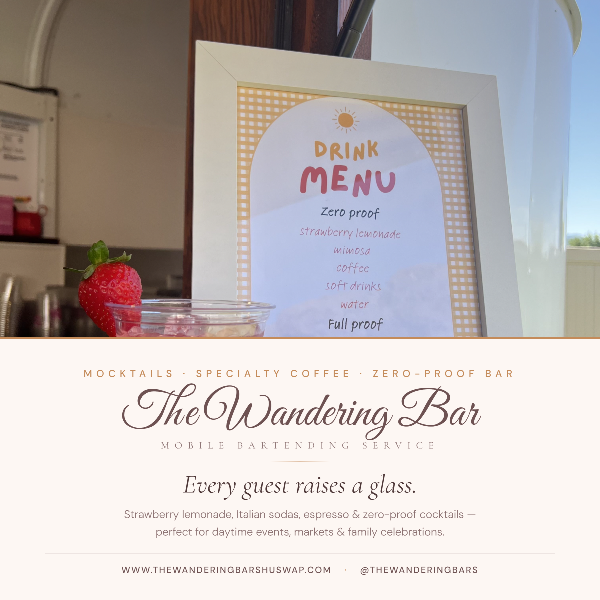

# The Wandering Bar — Promo Graphics

Brand-aware marketing graphics for **The Wandering Bar**, a luxury mobile bartending service in Kamloops, BC.
Built from the live site's design system — palette `#6E5252` / `#C48B5A`, *Great Vibes* script logo, *Cormorant Garamond* headings, film-grain finish.

🔗 **Website:** [www.thewanderingbarshuswap.com](https://www.thewanderingbarshuswap.com/) · **Instagram:** [@thewanderingbars](https://www.instagram.com/thewanderingbars)

> 🖼️ **Live gallery:** view all 24 graphics at the GitHub Pages URL shown in the repo's **Settings → Pages**.

---

## Campaigns

Six campaigns, each in four formats (square 1200×1200, story 1080×1920, banner 1200×675, print poster 2550×3300 @ 300 DPI). Same brand system, different photo, copy and layout per campaign.

| Campaign | Look | Message |
|---|---|---|
| **Brand** | Bottom-anchored lockup over the bride & trailer hero | *Luxury that travels to you.* |
| **Weddings** | Cream invitation card floating over the field-lounge photo | *To love, laughter & happily ever after.* |
| **Private Parties** | Golden-hour service shot, pill badge overline | *Bring the bar to the party.* |
| **Craft Cocktails** | Dark & moody smoked-cocktail close-up, left-aligned type | *Cocktails worth travelling for.* |
| **Now Booking 2026** | Type set in the sky above the trailer, caramel date tag | *Your date won't wait.* |
| **Zero-Proof & Coffee** | Retro flyer band under the mocktail-menu photo | *Every guest raises a glass.* |

### Sample — one per campaign

  
  

---

## Regenerating

Graphics are rendered from `template.html` via headless Chromium:

```bash
npm install puppeteer
node render.js            # all campaigns
node render.js booking sips   # just a subset
```

One parametric template drives everything: `template.html?c=<campaign>&f=<format>` where campaign is `brand|wedding|party|craft|booking|sips` and format is `square|story|banner|poster`. Edit copy in the `campaigns` object inside `template.html`; per-campaign layout lives in the `body[data-c=…]` CSS blocks.

The **brand** campaign keeps the original un-prefixed filenames (`wanderingbar-square-1200.png` …) so earlier links keep working.
