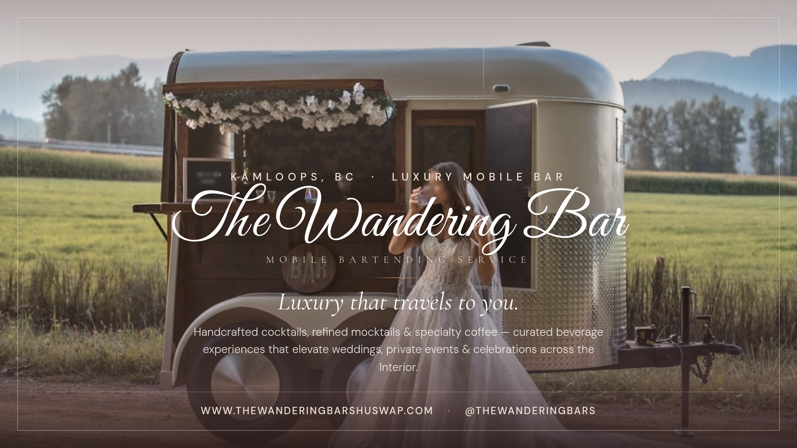

# The Wandering Bar — Promo Graphics

Brand-aware marketing graphics for **The Wandering Bar**, a luxury mobile bartending service in Kamloops, BC.
Built from the live site's design system — palette `#6E5252` / `#C48B5A`, *Great Vibes* script logo, *Cormorant Garamond* headings, film-grain finish.

🔗 **Website:** [www.thewanderingbarshuswap.com](https://www.thewanderingbarshuswap.com/) · **Instagram:** [@thewanderingbars](https://www.instagram.com/thewanderingbars)

> 🖼️ **Live gallery:** once GitHub Pages finishes building, view at the Pages URL shown in the repo's **Settings → Pages**.

---

### 1. Square — 1200×1200 (FB Marketplace / IG feed)


### 2. Story — 1080×1920 (IG / FB Stories & Reels)


### 3. Banner — 1200×675 (FB cover / link previews)


### 4. Poster — 8.5×11 @ 300 DPI (print flyer)


---

## Regenerating

Graphics are rendered from `template.html` via headless Chromium:

```bash
npm install puppeteer
node render.js
```

Edit copy/layout in `template.html` (one parametric template drives all four formats via `?f=square|story|banner|poster`).
